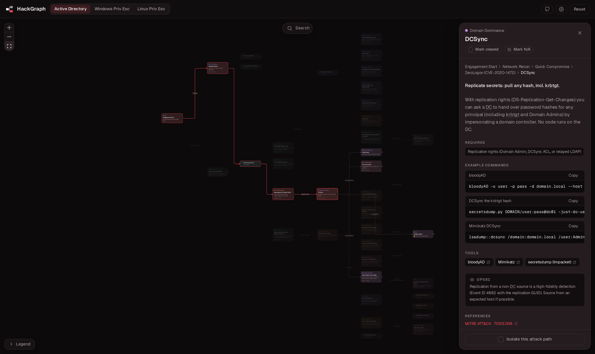

<div align="center">

# HackGraph

Interactive attack-path explorer for offensive security.

[](https://hackgraph.github.io/)
[](https://github.com/HackGraph/hackgraph.github.io/actions/workflows/deploy.yml)
[](LICENSE)

### [hackgraph.github.io](https://hackgraph.github.io/)



</div>

Start at a foothold and expand the graph one technique at a time until you reach the goal: Domain Admin, SYSTEM, or root. Every node is a short cheat-sheet with what the technique does, the tools, copy-paste commands, its MITRE ATT&CK id, what it needs, and how it gets caught. It all runs in your browser, with no backend and nothing to install.

## Maps

- **Active Directory:** from a foothold to Domain Admin and persistence.
- **Windows Privilege Escalation:** from a user shell to NT AUTHORITY\SYSTEM.
- **Linux Privilege Escalation:** from an unprivileged shell to root.

## Run locally

```bash
npm install
npm run dev
```

The app runs at http://localhost:5173. `npm run build` builds to `dist/` and `npm test` runs the tests.

## Contributing

The maps are plain data in `src/data/`, never the engine, so adding a technique or a whole new domain is just editing files. New maps appear in the header automatically. See [CONTRIBUTING.md](CONTRIBUTING.md).

## Acknowledgements

HackGraph is built on the work of the offensive-security community. The mindmap-style format was inspired by the [Orange Cyberdefense mindmaps](https://github.com/Orange-Cyberdefense/ocd-mindmaps), and the techniques lean on these projects, which are cited throughout and worth following on their own:

- [HackTricks](https://book.hacktricks.wiki/)
- [The Hacker Recipes](https://www.thehacker.recipes/)
- [PayloadsAllTheThings](https://github.com/swisskyrepo/PayloadsAllTheThings)
- [BloodHound and SpecterOps research](https://bloodhound.specterops.io/)
- [GTFOBins](https://gtfobins.github.io/) and [LOLBAS](https://lolbas-project.github.io/)

Each technique also links its own primary sources and credits the tools it uses.

## License

[MIT](LICENSE). For authorized security testing, CTFs, and learning.
