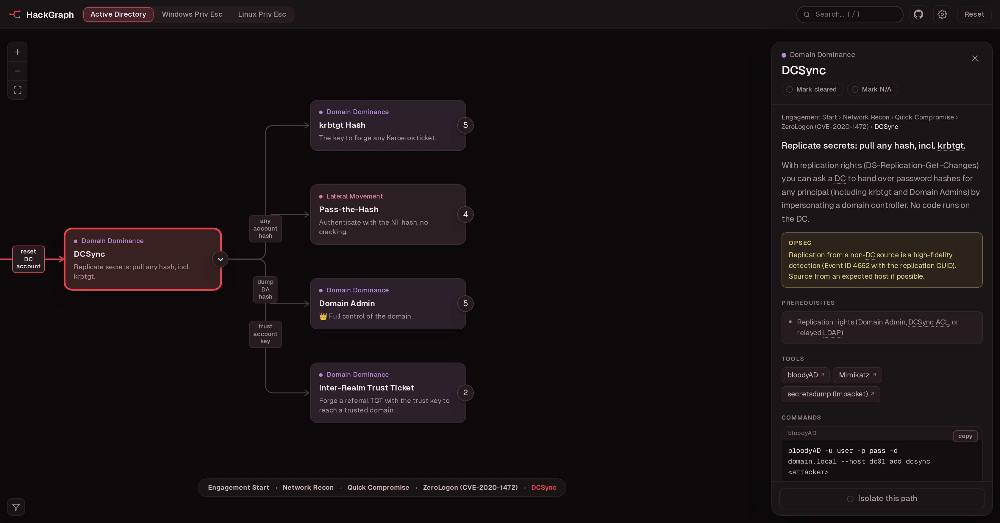

<div align="center">

# HackGraph

Interactive attack-path explorer for offensive security.

[](https://hackgraph.github.io/)
[](https://github.com/HackGraph/hackgraph.github.io/actions/workflows/deploy.yml)
[](LICENSE)

### [hackgraph.github.io](https://hackgraph.github.io/)



</div>

Start from a foothold and expand one technique at a time toward Domain Admin, SYSTEM or root. Every node gives you what the technique does, the tools and copy-paste commands, its MITRE ATT&CK id, what it needs first, and how loud it is. Runs entirely in the browser.

## Maps

- **Active Directory:** from a foothold to Domain Admin and persistence.
- **Windows Privilege Escalation:** from a user shell to NT AUTHORITY\SYSTEM.
- **Linux Privilege Escalation:** from an unprivileged shell to root.

## Run locally

```bash
node tools/serve.mjs      # http://localhost:5173
```

There is no build and nothing to install. The repository is the site: GitHub Pages serves
these files as they are, so what you see locally is what ships.

```bash
node --test                    # content lint, adapter tests, engine tests
node tools/gen-reference.mjs   # rebuild the static reference pages after a content change
node tools/check-refs.mjs      # check every reference URL still resolves
```

## Contributing

The maps are plain data in `src/data/`, never the engine, so adding a technique or a whole new domain is just editing files. New maps appear in the header automatically. Run `node --test` before opening a PR, and `node tools/gen-reference.mjs` if you changed content.

## Acknowledgements

HackGraph is built on the work of the offensive-security community. The mindmap-style format was inspired by the [Orange Cyberdefense mindmaps](https://github.com/Orange-Cyberdefense/ocd-mindmaps), and the techniques lean on these projects, which are cited throughout and worth following on their own:

- [HackTricks](https://book.hacktricks.wiki/)
- [The Hacker Recipes](https://www.thehacker.recipes/)
- [PayloadsAllTheThings](https://github.com/swisskyrepo/PayloadsAllTheThings)
- [BloodHound and SpecterOps research](https://bloodhound.specterops.io/)
- [GTFOBins](https://gtfobins.github.io/) and [LOLBAS](https://lolbas-project.github.io/)

Each technique also links its own primary sources and credits the tools it uses.

## License

[MIT](LICENSE). For authorized security testing, CTFs, and learning.
